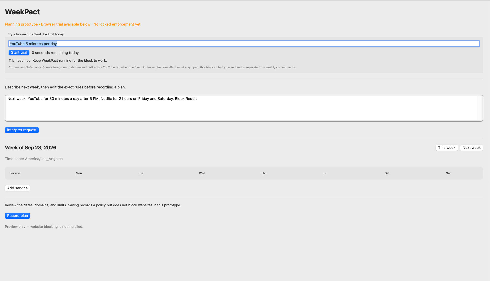

# WeekPact

Choose websites, set a daily limit, and pick the midnight when the rule ends.

WeekPact is a macOS local usage tracker with a compact **Today / Lock / Report** interface. It offers fixed website limits for YouTube, Netflix, Facebook, Messenger, Instagram, Reddit and Quora. The current locked mode uses Apple's restricted Network Extension and therefore cannot be signed with a free Personal Team, even for use on your own Mac. WeekPact also has its own local blocking test below; no third-party blocker or paid Apple membership is needed for that test. Daily limits are not yet connected to it.

The older five-minute YouTube trial is still available under Today for testing; it can be ended immediately. A **locked** rule starts now and ends at the start of the selected day at 12:00 AM. The chosen daily minutes refill each local midnight, but the rule itself cannot be reset from WeekPact before its end. This is a local software lock, not a guarantee against an administrator removing or disabling macOS protection.

**[Current build plan and progress](docs/ROADMAP.md)** — the building blocks and what each must prove.

## Run on a Mac

To try usage tracking, install Apple's Xcode command line tools if needed (`xcode-select --install`). Then open Terminal:

```sh
git clone https://github.com/pandeydeep9/WeekPact.git
cd WeekPact
swift run WeekPactApp
```

In **Today**, WeekPact counts frontmost Safari/Chrome website time while its process runs. **Lock** selects fixed services, a daily allowance (30 minutes, 1 hour, 2 hours or 3 hours), and the midnight when the rule expires. **Report** summarizes the last seven days when you request it; typing `generate report` works too. The `swift run` command above **does not block websites**. See [usage and privacy](docs/USAGE.md) and the [design](docs/DESIGN.md).

### Test WeekPact's local blocker

In the WeekPact directory on your Mac, run:

```sh
sudo bash scripts/test-weekpact-block.sh trial youtube
```

Type `TEST` when prompted. WeekPact briefly blocks the main YouTube website names in macOS `/etc/hosts` and installs its own root-owned `launchd` job to remove the entry after two minutes, including after a restart. Run `sudo bash scripts/test-weekpact-block.sh status` to see how much time remains; repeating `trial` while it is active does not restart the timer. A cached YouTube page may display while video and search fail. Check whether a new video actually plays, then verify the site works after the timer ends. To repeat the harmless test, use `trial example`. This is a system-wide DNS test, **not** the finished daily-limit feature: existing video streams, unlisted YouTube hosts, a browser using its own DNS, a VPN, or an administrator can bypass it. We will not present a weekly lock as enforced until its full allowance and browser behavior have been tested on your Mac.

This is source-run code, not a finished locked-mode installer. The [original signed-filter build](docs/BUILD.md) remains available for developers who already have that capability. A user who administers this Mac can ultimately disable local protections.

### Prototype screenshot

The screen supplied during testing, before the trial status and layout update in this PR:


